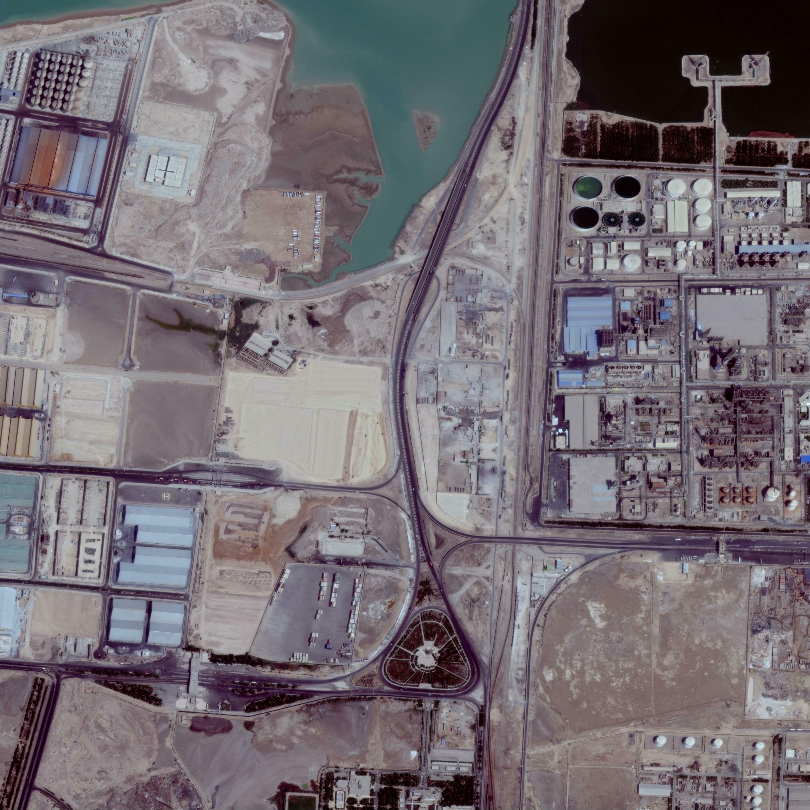
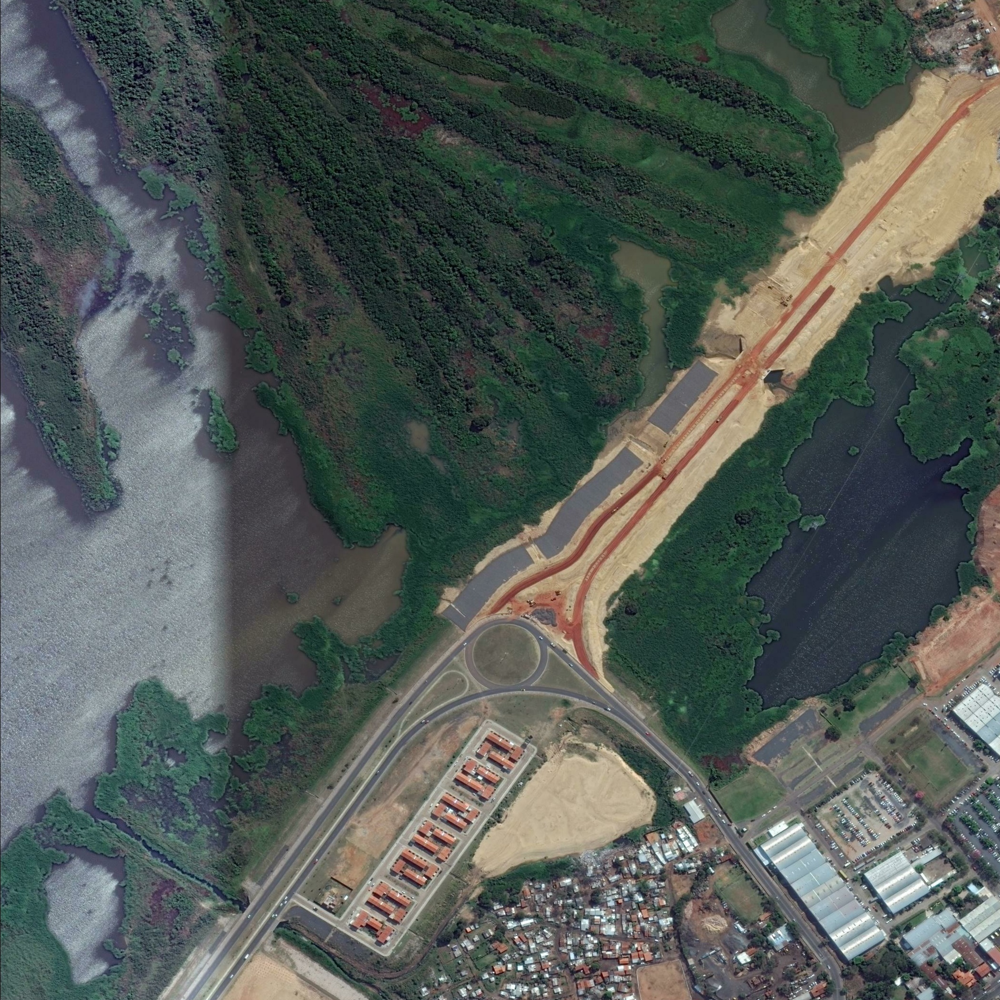

# OrbitRS-——基于任务自适应视觉证据路由的统一遥感多模态大模型

输入图像、文本和可选任务类型，系统自动判断处理路线、等待可用GPU并返回答案。

本文分为三部分：**示例展示 → 推理使用 → 复现流程**。已有服务直接看第二部分；首次部署从第三部分开始。当前版本为 `phase1-20260903-rc1`。

## 一、示例展示

下面从既有测试记录中各选取一例回答正确的 VRSBench、XLRS-Bench 和 MME-RS 样本，用于展示效果，**不代表整体准确率，也不是本次重新运行得到的结果**。

这里的“原输出”指数据集参考答案，不是另一个基线模型的输出；“我们的推理输出”保留历史模型返回的原文。原图文件保持原始尺寸及字节内容，页面只限制显示宽度。为便于迁移，输入图像路径改为仓库相对路径；客户端会在服务器上转换为绝对路径后提交。

### 1.1 VRSBench：识别人造目标

样本：`vrsbench_05863_0000_vqa_0`；原图：512 × 512；处理路线：通用图像理解。此例来自历史统一网关的真实成功请求。


原输入：

```json
{
  "image": "examples/images/1_05863_0000.png",
  "text": "What is the prominent man-made structure in the image?",
  "task_type": "vqa"
}
```

原输出（数据集参考答案）：`Windmill`。

我们的原始推理输出：

```text
windmill
```

结果核对：忽略大小写后答案一致。人工视觉核对可见图像右上方的风机和投影；这段解释是展示说明，不是模型额外生成的文本。

[查看原图](examples/images/1_05863_0000.png) · [完整输入、参考答案与历史返回](examples/showcase/vrsbench.json) · 复用命令：`python3 scripts/client.py submit --sample small_vqa`。

### 1.2 XLRS-Bench：根据整体布局推断区域用途

样本：lite评测清单第 `88` 行；原图：4096 × 4096；处理路线：高分辨率全局理解。此例来自历史子路由独立评测，不是本发布版统一网关的新请求。



原始问题与全部选项：

```text
What do the multiple storage tanks, industrial buildings, and roads in the image indicate?

(A) Reduced efficiency in industrial transportation and logistics
(B) This area is now a commercial district.
(C) This area could be a refinery or a chemical plant.
(D) Urban planners have neglected environmental management.
```

回放输入：`image = examples/images/xlrs_000088.jpg`，`task_type = complex_reasoning`；`text`包含上述问题、全部选项及仅返回选项字母的格式要求。客户端内置了完整请求，不需要手工拼接。

原输出（数据集参考答案）：`C`，即“该区域可能是炼油厂或化工厂”。

我们的原始推理输出：

```text
C
```

结果核对：选项完全一致。人工视觉核对可见成组圆形储罐、密集工业装置、厂房和道路，支持工业设施的语义判断；不能仅凭该例断言具体企业或精确生产用途。

[查看原图](examples/images/xlrs_000088.jpg) · [完整输入、参考答案与历史返回](examples/showcase/xlrs_bench.json) · 复用命令：`python3 scripts/client.py submit --sample xlrs_reasoning`。

图像直接取自实际评测所用Arrow中的原始JPEG字节，未重新编码。数据集记录路径虽然以 `.png` 结尾，存储格式实际为JPEG，因此导出文件使用 `.jpg`。完整推理提示词按保留的评测器函数重建，JSON中明确标注来源，不冒充原日志直接记录的提示词。

### 1.3 MME-RS：识别局部目标颜色

样本：`perception/remote_sensing/color/0043`；原图：2098 × 2098；处理路线：高分辨率局部细节搜索。此例来自历史子路由独立评测。



原始问题与全部选项：

```text
What's the color of the rectangular containers in the rectangular ground at the bottom of the picture?

(A) White
(B) Red
(C) Green
(D) Yellow
(E) This image doesn't feature the color.
```

回放输入：`image = examples/images/mme_color_0043.png`，`task_type = color`；`text`包含上述问题、全部选项及仅返回选项字母的格式要求。

原输出（数据集参考答案）：`B`，即“红色”。

我们的原始推理输出：

```text
B
```

结果核对：选项完全一致。人工视觉核对可见画面下方矩形场地内成列的红色/红褐色集装箱。问题明确限定目标及区域，避免只问“目标是什么颜色”造成指代不清。

[查看原图](examples/images/mme_color_0043.png) · [完整输入、参考答案与历史返回](examples/showcase/mme_rs.json) · 复用命令：`python3 scripts/client.py submit --sample mme_color`。

三例均可用同一个客户端重新提交，但历史结果不保证在不同环境、模型版本或参数下逐字重现。新机器的真实推理结果应自行保存、核对。更多输入模板、双图示例及证据边界见 [示例说明](examples/README.md)；完整数据集来源见 [数据说明](assets/DATASETS.md)。

## 二、使用者如何进行推理

本部分面向**已经部署好服务**的使用者，不要求重新下载模型或训练。若尚未部署，先完成第三部分。除SSH隧道命令外，以下命令均在**推理服务器上的仓库根目录**执行。

### 2.1 连接服务

服务器终端中检查服务：

```bash
python3 scripts/client.py health
python3 scripts/client.py workers
```

服务未运行时由部署者按第三部分启动；不要对同一套任务库重复启动网关。

若从自己的电脑使用网页，在本地PowerShell建立SSH隧道并保持窗口开启：

```powershell
ssh -N -o ExitOnForwardFailure=yes -L 7860:127.0.0.1:7860 用户名@服务器地址 -p SSH端口
```

随后打开 `http://127.0.0.1:7860/docs`，即可在网页中调用预览和推理接口。服务器自身访问无需隧道。服务只监听回环地址，本版本没有公网鉴权，不要直接开放公网端口。

### 2.2 先试一个自带案例

```bash
python3 scripts/client.py samples
python3 scripts/client.py preview --sample small_vqa
python3 scripts/client.py submit --sample small_vqa
```

`preview`只探测图像和判断路线，不加载模型；低置信度文本分类推迟到真实提交时，预览结果可能是暂定路线。`submit`立即返回任务ID，请保存。

用返回的ID持续观察：

```bash
python3 scripts/client.py watch --job-id 上一步返回的任务ID
```

完成后，完整返回中的 `result.answer` 是规范化答案，`result.raw_answer` 是模型原文；`result.task`、`route`、`image_meta`、`timing` 和 `worker_gpus` 分别记录任务判断、路线依据、图像尺寸、耗时及实际GPU。

测试另外两例时，只替换示例ID：

```bash
python3 scripts/client.py preview --sample xlrs_reasoning
python3 scripts/client.py submit --sample xlrs_reasoning
python3 scripts/client.py preview --sample mme_color
python3 scripts/client.py submit --sample mme_color
```

建议每例完成并保存结果后再提交下一例；高分辨率路线需要更多显存，显存不足会排队。

### 2.3 换成自己的图像与问题

把图像放到服务器上有读取权限、且已加入 `allowed_image_roots` 白名单的目录。创建一个 `request.json`，内容如下（路径换成真实服务器绝对路径）：

```json
{
  "image": "/absolute/server/path/my_image.png",
  "text": "How many ships are visible in this image?",
  "task_type": "counting"
}
```

```bash
python3 scripts/client.py preview --request request.json
python3 scripts/client.py submit --request request.json
python3 scripts/client.py watch --job-id 返回的任务ID
```

三个字段的填写方法：

- `image`：一张图的服务器绝对路径，或两张图的路径数组。不能填写本地Windows路径、网页链接或Arrow文件路径；本接口不是图片上传接口。
- `text`：完整问题或指令。选择题必须包含全部选项，颜色/位置题要明确指定目标；不能为空，最长4096字符。
- `task_type`：可以省略、填 `null` 或 `auto`；明确任务时可填 `caption`、`vqa`、`counting`、`grounding`、`color`、`position`、`complex_reasoning` 等。完整枚举见 [输入schema](router/app/schemas.py)。

双图变化描述的输入形式：

```json
{
  "image": ["/absolute/server/path/before.png", "/absolute/server/path/after.png"],
  "text": "Compare the two images and describe the changes.",
  "task_type": "change_caption"
}
```

顺序必须是变化前、变化后。也可以用 `python3 scripts/client.py submit --sample change_pair` 检查自带双图；该固定双图样本的成功输出仍待验证。第一阶段做变化描述，不承诺输出变化mask。

### 2.4 查看过程、保存结果与取消排队

典型任务状态为 `queued → loading_model → running → succeeded`。显存不足时进入 `queued_waiting_gpu`；需要补充任务分类时可能出现 `classifying`；异常结束为 `failed`。轮询可能跳过短暂状态，不表示缺少处理步骤。

```bash
python3 scripts/client.py workers
python3 scripts/client.py get --job-id 任务ID
python3 scripts/client.py get --job-id 任务ID --output runtime/my-result-001.json
tail -f runtime/logs/router.log
```

保存路径使用新文件名，客户端不会覆盖已有结果。`router.log`记录业务和worker事件，`gateway.log`记录进程及HTTP访问；不是逐token可视化。计时字段的边界说明见 [全过程字段说明](docs/TRACE.md)。

仅取消尚未开始运行的排队任务：

```bash
python3 scripts/client.py cancel --job-id 任务ID
```

退出 `watch` 不会自动取消服务器任务，稍后仍可用同一ID查询。模型按需加载，最后一次请求后空闲约15分钟退出；没有合适GPU时持续排队，不跨路线降级、不终止其他用户进程。

需要同步等待也可以执行 `python3 scripts/client.py infer --sample small_vqa`。仅要答案时，网页或HTTP客户端调用 `POST /v1/infer?trace=false`；异步方式更适合模型首次加载或GPU资源紧张的情况。

## 三、当前版本的复现流程

本部分面向在新服务器上复现第一阶段的部署者。以下是**现有实现对应的流程和已知缺口，不是已经验收通过的一键安装承诺**：适配器和官方模型链接已经提供，但固定第三方运行源码的分发材料尚未补齐，干净Linux环境及全部路线真实推理仍待验证。请先阅读 [验证记录](docs/VALIDATION.md)，缺少材料时不要用上游最新分支替代后宣称等价复现。

### 3.1 获取代码并记录版本

```bash
git clone --branch phase1-release https://github.com/hahaliu0318-rgb/Challenge_Cup.git
cd Challenge_Cup
git rev-parse HEAD
```

仓库目前为私有，需要先取得读取权限；评审也可使用另行提供的源码附件。复现记录必须保留实际commit。不要将第二阶段方案当成该版本的实现。

### 3.2 下载并校验模型材料

项目适配器：[百度网盘——挑战杯-698832](https://pan.baidu.com/s/1bKJZ7LO6APt-LjidIA7wyA?pwd=xhst)。**提取码：`xhst`；长期有效（发布方确认）**。网盘登录要求、独立下载和下载后哈希仍待核验。

文件：`challenge-cup-phase1-adapter_phase1-20260903-rc1.zip`，139,921,887字节（约133.44 MiB）。下载ZIP及同名校验文件，在下载目录执行：

```bash
sha256sum -c challenge-cup-phase1-adapter_phase1-20260903-rc1.zip.sha256
```

预期ZIP的SHA256：

```text
a7305ac9feb0f6c034e82caffdd8e407b52914c7b3310d708c966eaddc64c025
```

解压到模型根目录，例如 `/opt/challenge-assets/`；ZIP已经包含 `general_adapter/`，不要再嵌套同名目录。进入解压后的适配器目录，执行 `sha256sum -c SHA256SUMS.txt` 核验内部文件。

其他模型和视觉/检索依赖按 [固定官方链接清单](assets/OFFICIAL_DEPENDENCIES.md) 下载，完整保留配置、词表、处理器、索引和全部权重分片。通用基座必须是适配器对应的原始非AWQ版本。平台、版本、许可和下载核验边界见 [大文件下载说明](assets/DOWNLOADS.md)。

建议布局如下，路径可按本机权限调整：

```text
Challenge_Cup/
  external/                  固定运行源码，不能用环境或权重代替
/opt/challenge-assets/
  general_base/
  general_adapter/
  global_model/
  global_vision/
  detail_model/
  detail_vision/
  retrieval_model/
```

`external/`中需要全局推理代码、细节搜索代码及配套实现的已验证兼容版本。当前固定来源、兼容修改范围与缺口见 [依赖与署名](docs/DEPENDENCIES.md) 和 [源码文件清单](assets/runtime_sources_manifest.json)；未补齐前无法承诺完整从零复现。

### 3.3 准备环境和GPU

使用Linux GPU服务器。先检查 `nvidia-smi`，再按 [环境安装步骤](environments/README.md) 建立三个独立推理环境；不要把不同路线的依赖合并到一个环境。该文档记录安装命令和服务器观测版本，未锁定的补充依赖仍需在干净机器复测。

调度门槛：通用路线约10 GiB空闲显存；全局高分辨率路线两张各约22 GiB；细节路线约23 GiB主推理卡加约9.5 GiB搜索卡。双卡路线需满足相应BF16要求。门槛不等于所有输入的峰值显存保证，应为其他进程和大图预留余量。

建立轻量网关环境：

```bash
python3 -m venv .venv
.venv/bin/python -m pip install -r router/requirements-router.txt
```

### 3.4 生成本机配置

```bash
.venv/bin/python scripts/configure.py \
  --asset-root /opt/challenge-assets \
  --env-root /opt/challenge-envs \
  --general-gpus 0 \
  --global-gpus 0,1 \
  --detail-gpus 1,2
python3 scripts/prepare_model_views.py --asset-root /opt/challenge-assets
```

GPU编号只是三卡机器示例，以本机 `nvidia-smi` 为准；细节路线顺序为主推理卡、搜索卡。模型配置视图只生成小配置和符号链接，用于迁移视觉依赖路径，不复制或修改权重。视图已存在时先人工确认，不要重复覆盖。

检查生成的 `router/config/router.yaml`、`router/config/models.yaml`：模型与环境路径、依赖源码、GPU候选编号、图像白名单都必须对应本机。默认白名单包括本仓库 `examples/` 和 `runtime/`；添加自己的图像目录，不要把 `/` 加入白名单。本机配置不提交Git。

### 3.5 预检、测试与启动

```bash
.venv/bin/python scripts/preflight.py
.venv/bin/python scripts/preflight.py --imports
cd router
../.venv/bin/python -m unittest discover -s tests -v
cd ..
.venv/bin/python -m unittest discover -s tests -v
bash scripts/start.sh
```

预检失败先补齐文件、路径和依赖；`--imports`只做CPU导入检查，不提前加载权重。原路由测试在 `router/` 下执行，发布包装测试在仓库根目录执行。单元测试和模拟worker通过不能代替真实GPU推理。

启动脚本在前台运行，只启动 `127.0.0.1:7860` 的网关，不预加载模型。保持终端开启，或在自己的tmux会话中运行；同一任务库只能有一个网关。查看API文档、建立隧道和提交请求按第二部分操作。

### 3.6 回放样本并核对路线与答案

依次对 `small_vqa`、`xlrs_reasoning`、`mme_color` 执行 `preview → submit → watch → get --output`，每例记录自己的完整返回。第一部分提供原图、题目、参考答案和历史输出，便于逐项比较。不要在回放时先缩小大图，否则可能改变路由和推理条件。

当前规则按图像及任务判断，而不是按数据集名称判断：双图和最长边不超过1024的小图走通用路线；高分辨率局部细节任务走搜索路线；高分辨率全局描述、语义和复杂推理任务走全局路线。没有显存就排队。

扩展评测时按 [官方数据说明](assets/DATASETS.md) 获取原始数据和对应划分；选择题完整保留选项，双图保持A/B顺序，Arrow图像按样本提取且保留尺寸。全量模型评测、历史训练重跑和严格防泄漏审计不在“三个展示案例通过”的证明范围内；历史统计见 [结果记录](results/historical/README.md)，训练入口与缺失信息见 [训练说明](training/README.md)。

### 3.7 保存复现记录与整理提交材料

记录代码commit、模型版本/哈希、环境版本、GPU型号、完整输入、原始输出及任务状态。`succeeded`表示流程成功，不保证答案正确；不要将单个展示样本的耗时当作平均值、P95或TTFT。

不再使用服务时，由部署者执行 `bash scripts/stop.sh`。脚本只停止本发布包装启动且PID信息匹配的进程；不要手工终止其他人的GPU进程。

```bash
python3 scripts/check_release.py
python3 scripts/build_submission.py --output ../phase1_submission_DRAFT.zip
```

输出文件已存在时改用新文件名。严格验收 `python3 scripts/check_release.py --strict` 在待办未完成时应失败；不能仅因源码和网盘链接已提供，就标记所有复现通过。

按 [提交检查清单](docs/SUBMISSION_CHECKLIST.md) 补齐申报表、第一阶段技术报告、依赖材料和真实验收。最终作品总包命名为 `申报人所在单位－申报人姓名－作品名称－联系电话.zip`；当前适配器附件不用改成这个名字，个人信息也不必放入GitHub。

Built with Qwen. 主文以处理路线说明操作，真实依赖名称、固定版本及署名保留在 [维护者附录](docs/DEPENDENCIES.md)。通用路线的研究许可见 [许可说明](assets/ADAPTER_LICENSE.md)，本项目不替第三方模型、源码或数据重新授权。
