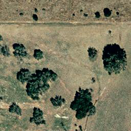
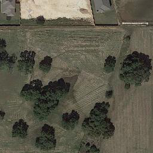

# 按步骤测试示例

1. 在服务器仓库根目录运行 `python3 scripts/client.py samples` 查看六个请求。
2. 先运行 `python3 scripts/client.py preview --sample small_vqa`，再 `submit` 和 `watch`。
3. 用 `small_caption` 测描述，用 `small_grounding` 测坐标格式。它们复用同一小图，但提示词不同；本次没有编造对应模型输出。
4. 用 `change_pair` 测双图，图片已按before/after命名。该示例保留输入与路由预期，未收集到该固定图片对应的成功输出，标记“待验证”。
5. 按 `assets/DATASETS.md` 下载原始大图，放到 `runtime/examples/03553_Toronto.png`，用 `large_detail` 和 `large_caption` 分别预览。
6. 确认显存充足再真实提交。全局大图路线的统一网关验收尚待补齐，不能把历史独立评测等同于本发布包实测。

| 示例ID | 图片 | 测试内容 | 历史证据 |
|---|---|---|---|
| small_vqa | 512×512单图 | 主要人造结构问答 | 两次历史输出均为 `windmill`，分别冷启动和热启动，不是两个独立任务案例 |
| small_caption | 同一小图 | 开放描述 | 待验证，无伪造输出 |
| small_grounding | 同一小图 | 目标框 | 待验证，无伪造输出 |
| change_pair | 两张256×256 | 变化描述 | 输入已备，输出待验证 |
| large_detail | 11500×7500原图，需下载 | 右下方方形建筑屋顶颜色选择题 | 历史输出 `D`，选项D为White；未独立核验答案正确性 |
| large_caption | 同一原始大图 | 详细描述 | 网关真实成功案例待验证 |

`catalog.json`中的图像路径是仓库相对路径；`client.py`在服务器运行时转换成绝对路径后再提交，API本身仍只接收服务器绝对路径。`reference_outputs/`记录完整原问题、模型原始输出、规范化结果与当次耗时。路径已去除内部账号信息，答案和耗时未改写。

历史小图冷启动总耗时17.234666秒、热启动1.131054秒；大图细节请求总耗时127.972183秒。这些是单条记录，不是均值、P95或硬件性能承诺；也不是本次重新运行所得。请以自己的任务返回为准。

图像与官方数据集的归属见 `assets/DATASETS.md`。本次收集了3张小原图，没有上传整个数据集，也没有缩小大图来替代历史输入。

## 小图预览

人工查看可在右上方看到风力发电设施及其投影；这只是核对图像内容的说明，不是新生成的模型输出。

上方为变化前、下方为变化后。人工可观察到后图上边缘出现建筑等差异；对应模型变化描述仍待真实生成，不能把这句话放入模型原始输出字段。
